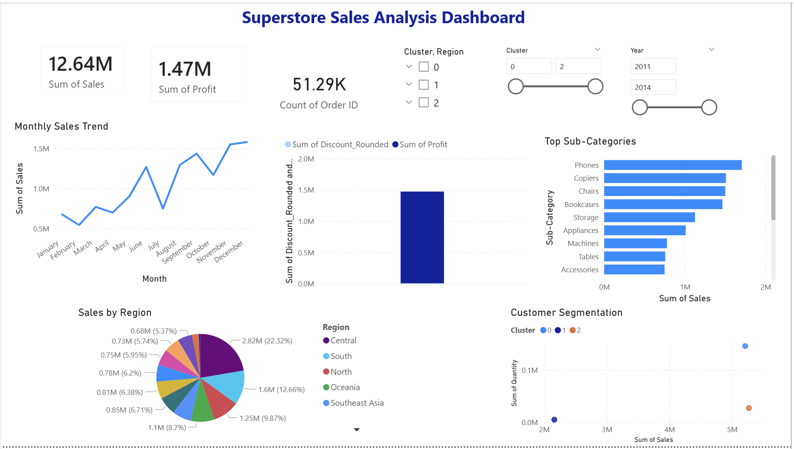

# Superstore Sales Analysis Dashboard

## Project Overview

In this project, I analyzed a retail Superstore dataset to understand sales patterns, customer behavior, and business performance. I used Python for data analysis and built an interactive dashboard in Power BI to visualize the insights.

---

## Tech Stack

* Python (Pandas, NumPy, Matplotlib, Scikit-learn)
* Power BI
* Excel/CSV dataset

---

## Key Features

* Cleaned and preprocessed raw sales data
* Analyzed sales and profit trends
* Visualized monthly sales performance
* Identified top-performing product categories
* Compared profit vs discount impact
* Performed customer segmentation using K-Means clustering

---

## Machine Learning

I used K-Means clustering to group customers based on their purchasing behavior (sales and quantity), which helped identify different customer segments.

---

## Dashboard Preview

---

## Key Insights

* Phones and Copiers generate the highest revenue
* Higher discounts often reduce overall profit
* Some regions contribute more to total sales than others
* Customer segmentation shows different buying patterns

---

## Conclusion

This project helped me understand how to work with real-world data, perform analysis, and present insights in a clear and interactive way using Power BI.
